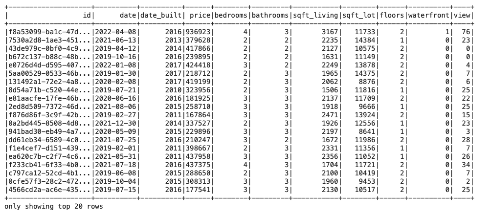
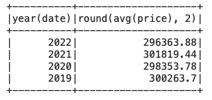
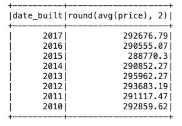

# Home Sales Analysis with PySpark

## Project Overview

This GitHub project is focused on analyzing home sales data using PySpark, a distributed data processing framework for big data. Google Colab is used for data processing which further run Spark SQL queries.  

### Steps

1. Google Colab use: create a new notebook file in Colab. 

2. PySpark Setup:
Import the necessary PySpark SQL functions for this assignment.
3. Data Loading:
Read the home_sales_revised.csv data in the starter code into a Spark DataFrame.
    

4. Temporary Table:
Create a temporary table called home_sales using the Spark DataFrame.
5. SparkSQL Queries:

- Average Price for a Four-Bedroom House:
    - What is the average price for a four-bedroom house sold for each year? Round off your answer to two decimal places.

    

- Average Price of a Home by Year Built:
    - What is the average price of a home for each year it was built that has three bedrooms and three bathrooms? Round off your answer to two decimal places.

    
    

- Average Price of a Home by Year with Specific Criteria:
    - What is the average price of a home for each year that has three bedrooms, three bathrooms, two floors, and is greater than or equal to 2,000 square feet? Round off your answer to two decimal places.

    

- View Rating for Homes Over $350,000:
    - What is the "view" rating for homes costing more than or equal to $350,000? Determine the run time for this query, and round off your answer to two decimal places.
- Caching:
    - Cache your temporary table home_sales.
    - Check if your temporary table is cached.
- Cached Query:
    - Using the cached data, run the query that filters out the view ratings with an average price of greater than or equal to $350,000. Determine the runtime and compare it to the uncached runtime.
- Parquet Data Processing:
    - Partition by the "date_built" field on the formatted parquet home sales data.
        - NOTE: A seperate folder named home_sales_partitioned is created that contain all the partitioned files. 

    - Create a temporary table for the parquet data.
- Parquet Query:
    - Run the query that filters out the view ratings with an average price of greater than or equal to $350,000 using the parquet data. Determine the runtime and compare it to uncached runtime.
- Uncaching:
    - Uncache the home_sales temporary table.
    - Verify that the home_sales temporary table is uncached using PySpark.

- Download your Home_Sales.ipynb file.
- Upload the notebook into your "Home_Sales" GitHub repository.

### Tools & libraries used: 
Google Colab, os, sys, findspark and Spark SQL queries.